<div align="center">

# 🚀 Full-Stack Agentic Voice Platform


<p>


</p>

### 🌟 *Enterprise-Grade AI Voice Platform with Seamless Integrations* 🌟

Transform your customer engagement with AI-powered conversations, intelligent automation, and universal integrations

[🚀 Get Started](#-quick-start) • [✨ Features](#-core-capabilities) • [🔗 Integrations](#-integrations) • [📖 Docs](#-documentation)

---

</div>

## 💎 Overview

<table>
<tr>
<td width="50%" align="center">

<br><br>
Leverage cutting-edge AI for natural, context-aware voice interactions that feel human
</td>
<td width="50%" align="center">

<br><br>
Connect with 20+ platforms including Zoho, Salesforce, HubSpot, and more
</td>
</tr>
<tr>
<td width="50%" align="center">

<br><br>
Unified booking across Calendly, Zoom, Google Calendar, Cal.com, and Microsoft
</td>
<td width="50%" align="center">

<br><br>
Scalable microservices architecture with production-grade security
</td>
</tr>
</table>

---

## ✨ Core Capabilities

<div align="center">

| 🎙️ **AI Voice** | 👥 **Lead Management** | 📊 **Analytics** | 🔄 **Integration** |
|:---:|:---:|:---:|:---:|
| Natural conversations | Auto capture & qualify | Real-time insights | Bidirectional sync |
| Multi-language support | Smart lead scoring | Custom dashboards | 20+ platforms |
| Sentiment analysis | Pipeline automation | Conversion tracking | Webhook support |
| Voice personas | Campaign orchestration | Performance metrics | Real-time updates |

</div>

---

## 🔗 Integrations

<div align="center">

### 🌐 **Connect with Your Favorite Tools**

</div>

### 📊 **CRM Platforms**

<p align="center">


</p>

<details>
<summary><b>🎯 CRM Features</b></summary>

- ✅ Contact & lead synchronization
- ✅ Custom field mapping
- ✅ Automated workflows
- ✅ Deal pipeline tracking
- ✅ Activity logging
- ✅ Real-time webhooks

</details>

---

### 📅 **Meeting & Scheduling**

<p align="center">


</p>

<details>
<summary><b>🎯 Scheduling Features</b></summary>

#### **Calendly**
- Smart availability sync
- Custom booking links
- Team scheduling
- Webhook notifications

#### **Cal.com**
- Open-source scheduling
- Custom branding
- Workflow automation
- Payment integration

#### **Zoom**
- Instant meetings
- Webinar hosting
- Recording management
- Breakout rooms

#### **Google Calendar**
- Multi-calendar support
- Recurring events
- Time zone intelligence
- Free/busy checking

#### **Microsoft Bookings**
- Enterprise scheduling
- Teams integration
- Staff management
- Customer notifications

#### **Zoho Bookings**
- Service-based appointments
- Resource allocation
- Payment processing
- Analytics & reporting

</details>

---

### 📧 **Communication & Email**

<p align="center">


</p>

<details>
<summary><b>🎯 Communication Features</b></summary>

#### **Gmail**
- Email automation
- Thread management
- Template support
- Bulk operations

#### **Microsoft Outlook**
- Exchange integration
- Calendar sync
- Contact management
- Enterprise email

#### **Twilio**
- Voice calls (inbound/outbound)
- SMS messaging
- Call recording
- IVR & routing

#### **SendGrid**
- Transactional emails
- Email templates
- Delivery tracking
- Analytics

#### **Slack**
- Team notifications
- Bot integration
- Channel automation
- Real-time alerts

</details>

---

### 🎯 **Marketing Automation**

<p align="center">


</p>

---

## 🏗️ Modern Tech Stack

<div align="center">

### **Frontend Excellence**


### **Backend Power**


### **AI & Voice Technology**


### **DevOps & Infrastructure**


</div>

---

## 🚀 Quick Start

<div align="center">

### **Get Up and Running in Minutes**

</div>

```bash
# 1️⃣ Clone the repository
git clone https://github.com/lovieheartz/Full-Stack-Agentic-VoicePlatform.git
cd Full-Stack-Agentic-VoicePlatform

# 2️⃣ Start with Docker Compose
docker-compose up -d

# 3️⃣ Access the platform
# 🌐 Frontend: http://localhost:5173
# 📡 API Gateway: http://localhost:80
# 📚 API Docs: http://localhost:8001/docs
```

<div align="center">

### 🎉 **That's it! You're ready to go!**

</div>

---

## 🎨 Architecture

```mermaid
graph TB
    A[React Frontend<br/>🎨 TypeScript + Vite] --> B[API Gateway<br/>⚡ Nginx]
    B --> C[Auth Service<br/>🔐 Port 8001]
    B --> D[AI Call Service<br/>🤖 Port 8002]
    B --> E[Campaign Service<br/>📊 Port 8003]
    B --> F[Integration Service<br/>🔗 Port 8004]
    B --> G[MCP Server<br/>🧠 Port 8005]

    F --> H[Zoho CRM]
    F --> I[Salesforce]
    F --> J[HubSpot]
    F --> K[Calendly]
    F --> L[Cal.com]
    F --> M[Google Calendar]
    F --> N[Microsoft 365]
    F --> O[Gmail/Outlook]
    F --> P[Twilio]

    style A fill:#61dafb,stroke:#333,stroke-width:2px
    style B fill:#009639,stroke:#333,stroke-width:2px
    style C fill:#10b981,stroke:#333,stroke-width:2px
    style D fill:#8b5cf6,stroke:#333,stroke-width:2px
    style E fill:#f59e0b,stroke:#333,stroke-width:2px
    style F fill:#3b82f6,stroke:#333,stroke-width:2px
    style G fill:#ec4899,stroke:#333,stroke-width:2px
```

<div align="center">



</div>

### 🔧 **Microservices**

| Service | Port | Purpose |
|:-------:|:----:|:--------|
| 🔐 **Auth/User** | 8001 | Authentication & user management |
| 🤖 **AI Call** | 8002 | Voice AI & conversation handling |
| 📊 **Campaign/Leads** | 8003 | Campaign orchestration & lead management |
| 🔗 **Integrations** | 8004 | External platform integrations |
| 🧠 **MCP Server** | 8005 | AI agent orchestration |
| 🎨 **Frontend** | 5173 | React user interface |
| ⚡ **API Gateway** | 80 | Nginx reverse proxy |

---

## 💼 Perfect For

<table>
<tr>
<td width="33%" align="center">
<h3>🏢 Sales Teams</h3>
<p>Automate outreach with intelligent AI voice agents</p>
</td>
<td width="33%" align="center">
<h3>📞 Call Centers</h3>
<p>Handle high call volumes with AI automation</p>
</td>
<td width="33%" align="center">
<h3>🚀 Startups</h3>
<p>Scale engagement without scaling headcount</p>
</td>
</tr>
<tr>
<td width="33%" align="center">
<h3>💼 Enterprises</h3>
<p>Enterprise-grade security & compliance</p>
</td>
<td width="33%" align="center">
<h3>📊 Marketing</h3>
<p>Voice campaigns with full analytics</p>
</td>
<td width="33%" align="center">
<h3>🛍️ E-commerce</h3>
<p>Personalized voice shopping experiences</p>
</td>
</tr>
</table>

---

## 🌟 Key Features

<div align="center">

| Feature | Description |
|:--------|:------------|
| 🎙️ **AI Voice Calls** | Natural AI-powered conversations |
| 📊 **Real-time Analytics** | Live insights & performance tracking |
| 🔄 **Auto CRM Sync** | Bidirectional synchronization |
| 📅 **Meeting Automation** | Schedule across all platforms |
| 🌍 **Multi-language** | Support for 50+ languages |
| 🔒 **Enterprise Security** | SOC 2 compliant, GDPR ready |
| ⚡ **High Performance** | Optimized for scale |
| 📱 **Mobile Ready** | Works on all devices |
| 🎯 **Smart Routing** | Intelligent call distribution |
| 📈 **Infinitely Scalable** | Handle millions of interactions |

</div>

---

## 📖 Documentation

<div align="center">

| 📚 Resource | 🔗 Link |
|:------------|:--------|
| Getting Started | [Quick Start Guide](#-quick-start) |
| API Reference | [View API Docs](http://localhost:8001/docs) |
| Integration Guides | [See Integrations](#-integrations) |
| Architecture | [View Architecture](#-architecture) |
| Deployment | [Deploy Guide](#-quick-start) |

</div>

---

## 🤝 Contributing

We love contributions! Join our community of developers.

```bash
# Fork, create a branch, and make your magic happen!
git checkout -b feature/amazing-feature
git commit -m "✨ Add amazing feature"
git push origin feature/amazing-feature
```

---

## 📄 License

Licensed under the **MIT License** - see [LICENSE](LICENSE) for details.

---

<div align="center">

## 🌟 Show Your Support

**Star this repo if you find it helpful!** ⭐


---

### 🚀 **Ready to Transform Your Communications?**

### [Get Started Now](https://github.com/lovieheartz/Full-Stack-Agentic-VoicePlatform)

---


### 🌐 Web Development • 🤖 AI Integration • 🎙️ Voice Technology

**Full-Stack Agentic Voice Platform** - *Where Intelligence Meets Conversation*

[⬆ Back to Top](#-full-stack-agentic-voice-platform)

</div>
